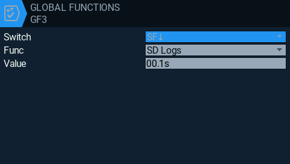
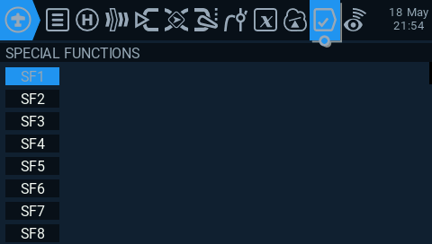

# StickExporterTX

StickExporterTX is a 3D Stick Exporter for EdgeTX/OpenTX logs.

## Quick Start Guide

To log your sticks on every model, go to `settings -> global functions` in your RC Controller.

There you can choose one of the free fields and edit it.
For `Switch` you choose the one, wo should activate the logging. For example, you can set it to the arm switch of your drone so that it is logging as long as the drone is armed.
`Func` must be set to `SD Logs` and with `Value` you should take the lowest in order to create a smoother animation.

If you want to set up logging for one model alone, go to `model -> special functions` in your RC Controller and repeat the previous step.

## Licence:

This project is released under the MIT license, for more information, check the [LICENSE](LICENSE.md) file.